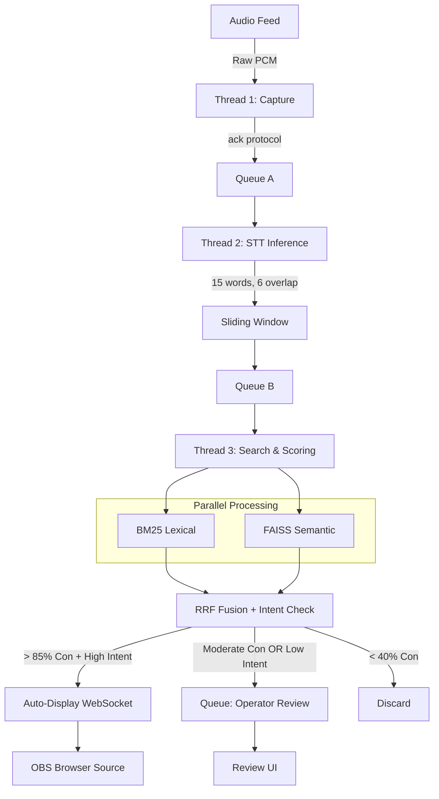

# Still

**Still** is a real-time sermon transcription and scripture presentation system built for live church services. It listens to the pastor's spoken audio, identifies when scripture is being quoted or paraphrased, and automatically displays the matched Bible verse on the broadcast screens — all with minimal human intervention.

## What It Does

1. **Listens** — A fine-tuned Continuous Stream STT engine transcribes the pastor's speech in real-time using a 15-word sliding window.
2. **Searches** — A hybrid search engine (BM25 lexical + FAISS semantic) simultaneously scans 186,000+ Bible verses to find the best match for what was just said.
3. **Scores** — Reciprocal Rank Fusion merges both search lanes into a single 0–100% confidence score, while an intent classifier determines if the pastor is actually quoting scripture.
4. **Displays** — High-confidence, high-intent matches are auto-displayed via a lightweight WebSocket → HTML/CSS pipeline ingested as a Browser Source in OBS/vMix. Lower-confidence matches are routed to the operator for manual approval.
5. **Archives** — Every transcript chunk, search result, and display event is persisted to a SQLite WAL database with a flat-file fail-safe.
6. **Extracts** — After the service, the complete transcript is sent to a cloud LLM (Gemini Flash / Claude Haiku) to extract prayer points, declarations, and prophetic words.

## System Requirements

| Resource | Minimum |
|----------|---------|
| **GPU** | NVIDIA, 4 GB VRAM (dedicated solely to STT inference) |
| **RAM** | 16 GB |
| **CPU** | Modern multi-core (Intel i5/Ryzen 5 or better) |
| **OS** | Linux (Windows and macOS support planned) |
| **Privileges** | Root / Administrator (required for NVML power state modification) |
| **Audio** | Wireless transmitter from FOH console (preferred) or room mic + DFN 3 |

## Architecture at a Glance

## Documentation Index

| Document | Description |
|----------|-------------|
| [architecture.md](architecture.md) | System-wide architecture, threading model, queue topology, and 4-phase lifecycle |
| [search_engine.md](search_engine.md) | Hybrid BM25 + FAISS search, RRF scoring, sliding window, deduplication |
| [intent_classification.md](intent_classification.md) | DistilBERT intent classifier, JSON fallback, trigger boundary math |
| [ai_models.md](ai_models.md) | All AI model specifications, primary/backup, memory placement |
| [gpu_and_hardware.md](gpu_and_hardware.md) | VRAM budget, GPU throttling via pynvml, thermal monitoring |
| [audio_ingestion.md](audio_ingestion.md) | sounddevice configuration, audio format specs, wireless vs DFN 3 |
| [database_and_storage.md](database_and_storage.md) | SQLite WAL, write queue, sequence IDs, flat-file fail-safe |
| [display_and_broadcast.md](display_and_broadcast.md) | WebSocket/HTML rendering, OBS Browser Source, theme system |
| [cloud_pipeline.md](cloud_pipeline.md) | Post-service LLM extraction, offline queuing, retry logic |
| [threading_and_lifecycle.md](threading_and_lifecycle.md) | Thread startup/teardown, poison pills, failover protocols |
| [questions.md](questions.md) | Architectural Q&A — the canonical source of truth for all resolved design decisions |
