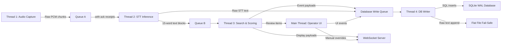

# System Architecture

This document defines the system-wide architecture of Still: the threading model, queue topology, data flow, and the four operational phases that govern a live service from boot to archive.

---

## Hardware Constraints

All architectural decisions are bound by a single, non-negotiable constraint:

| Resource | Budget |
|----------|--------|
| **GPU VRAM** | 4 GB total, dedicated exclusively to the primary STT model |
| **Standard RAM** | 16 GB minimum — hosts FAISS index, BM25 index, embedding model (ONNX), intent classifier, LRU caches, and all queues |
| **CPU** | Modern multi-core — drives the semantic embedding model, BM25 search, intent classification, and Vosk failover if GPU fails |

The architecture strictly partitions GPU and CPU workloads to prevent VRAM contention. See [gpu_and_hardware.md](gpu_and_hardware.md) for the full VRAM budget breakdown.

---

## Threading Model

Still operates on a multi-threaded, queue-decoupled architecture. No thread directly calls another thread's functions. All inter-thread communication flows through thread-safe FIFO queues.

| Thread | Runs On | Responsibility |
|--------|---------|----------------|
| **Main Thread** | CPU | UI rendering, operator controls, lifecycle management |
| **Thread 1 — Audio Capture** | CPU | Captures 16kHz/mono/float32 audio via `sounddevice`, pushes raw PCM to Queue A |
| **Thread 2 — STT Inference** | GPU | Pulls audio from Queue A, runs Faster-Whisper inference, appends text to the sliding window buffer, pushes 15-word blocks to Queue B |
| **Thread 3 — Search & Scoring** | CPU | Pulls text from Queue B, runs BM25 + FAISS in parallel, fuses scores via RRF, evaluates intent, routes display decision |
| **Thread 4 — Database Writer** | CPU | Pulls event payloads from the Database Write Queue, executes sequential SQL inserts into the SQLite WAL database, writes the append-only flat file |
| **Thread 5 — Hardware Monitor** | CPU | Polls GPU die temperature via `pynvml`, issues power limit commands when thermal thresholds are exceeded |
| **WebSocket Server** | CPU | Lightweight server (started during Phase 1) that pushes display payloads to the HTML/CSS/JS renderer consumed by OBS Browser Source |

> [!NOTE]
> Thread 2 is the only thread that touches the GPU. Every other thread runs exclusively on CPU and standard RAM. This is a deliberate architectural constraint to protect the 4 GB VRAM budget.

---

## Queue Topology

### Queue A — Audio Pipeline
- **Producer:** Thread 1 (Audio Capture)
- **Consumer:** Thread 2 (STT Inference)
- **Payload:** Raw 16kHz mono float32 PCM audio chunks
- **Special behavior:** Implements an **acknowledgment receipt protocol**. Chunks remain in a "pending" state until Thread 2 confirms successful transcription by pushing text to Queue B. If the GPU crashes, unacknowledged chunks are replayed to the Vosk failover model. See [threading_and_lifecycle.md](threading_and_lifecycle.md) for details.

### Queue B — Text Pipeline
- **Producer:** Thread 2 (STT Inference), via the 15-word sliding window
- **Consumer:** Thread 3 (Search & Scoring)
- **Payload:** 15-word text blocks (or partial blocks after TTL flush)

### Database Write Queue
- **Producers:** Thread 2 (raw STT text), Thread 3 (search metrics, display events), Main Thread (UI events)
- **Consumer:** Thread 4 (DB Writer)
- **Payload:** Independent event payloads with monotonic sequence IDs and session UUIDs
- **Guarantee:** Single-writer serialization eliminates all SQLite locking conflicts

---

## The Four Phases

### Phase 1: Initialization and Startup

1. **Application launch.** The main UI thread loads.
2. **Service initialization** (all run before the operator starts transcription):
   - WebSocket server is started on a local port
   - FAISS vector index (186,000+ verse embeddings, 384 dimensions each) loaded into RAM
   - BM25 inverted index loaded into RAM
   - `all-MiniLM-L6-v2` embedding model loaded via ONNX Runtime (CPU execution provider)
   - `intent_triggers.json` deserialized and algorithmically compiled into bounded Token-Window Regex statements
   - Custom fine-tuned Faster-Whisper STT model loaded into GPU VRAM
   - Vosk failover model (`vosk-model-small-en-us`) loaded completely dormant into standard RAM (Warm Standby)
   - `pynvml` initialized, GPU handle acquired
   - Session UUID generated (e.g., `2026-04-16_AM`) for sequence ID scoping
   - SQLite WAL database connection opened
   - Append-only flat file opened with ISO 8601 naming convention
3. **Operator clicks "Start Transcription."** Background threads spawn. Audio capture begins.

### Phase 2: Live Processing

This is the active service loop. It runs continuously until the operator ends the service.

| Stage | What Happens | Time Budget |
|-------|-------------|-------------|
| **2A: Transcription** | Thread 1 captures audio → Queue A → Thread 2 transcribes → sliding window fills → Queue B | Continuous |
| **2B: Search & Scoring** | BM25 + FAISS run in parallel → RRF fusion → Min-Max normalization → 0–100% confidence | ~35 ms |
| **2C: Intent Check** | Regex Triggers evaluate quote intent as a Boolean State: True / False | < 1 ms |
| **2D: Display Decision** | Auto-display (>85% + High intent), operator queue (moderate + Low intent), or discard | ~5 ms |
| **2E: Persistence** | All events pushed to DB Write Queue asynchronously | Non-blocking |
| **2F: Hardware Monitoring** | Thread 5 polls GPU temperature, throttles/restores power as needed | Every N seconds |

Total search-to-display latency: **~40 to 80 milliseconds** per 15-word window.

### Phase 3: Service Conclusion and Cloud Analysis

1. **Operator clicks "End Service."** The microphone feed is cut.
2. **Thread teardown** via sequential poison pills — see [threading_and_lifecycle.md](threading_and_lifecycle.md).
3. **Transcript collation.** Chunks are stitched using `ORDER BY sequence_id ASC` within the active session UUID.
4. **Cloud handoff.** The monolithic transcript (~15,000 words / ~20,000 tokens) is sent to the cloud LLM.
   - If the internet is down, the payload is queued locally. Reconnection polling uses exponential backoff with jitter.
   - See [cloud_pipeline.md](cloud_pipeline.md) for full details.
5. **Extraction.** The LLM returns structured JSON containing declarations, prayer points, and prophetic words.

### Phase 4: Archival and Retrieval

1. **Review and export.** Extracted declarations and prophecies appear in the local UI for operator review.
2. **Persistent storage.** All data (transcript, search metrics, display events, extracted data) lives in the SQLite WAL database.
3. **Future indexing.** Extracted prophecies and transcript summaries are vectorized and added to the local FAISS index for natural-language retrieval across historical services.
4. **Export options.** Data can be copied or exported to formatted PDF.

---

## Cross-References

- **Search pipeline details:** [search_engine.md](search_engine.md)
- **Intent classification:** [intent_classification.md](intent_classification.md)
- **AI model specifications:** [ai_models.md](ai_models.md)
- **GPU and thermal management:** [gpu_and_hardware.md](gpu_and_hardware.md)
- **Audio capture:** [audio_ingestion.md](audio_ingestion.md)
- **Database and storage:** [database_and_storage.md](database_and_storage.md)
- **Display and broadcast:** [display_and_broadcast.md](display_and_broadcast.md)
- **Cloud extraction:** [cloud_pipeline.md](cloud_pipeline.md)
- **Thread lifecycle:** [threading_and_lifecycle.md](threading_and_lifecycle.md)
