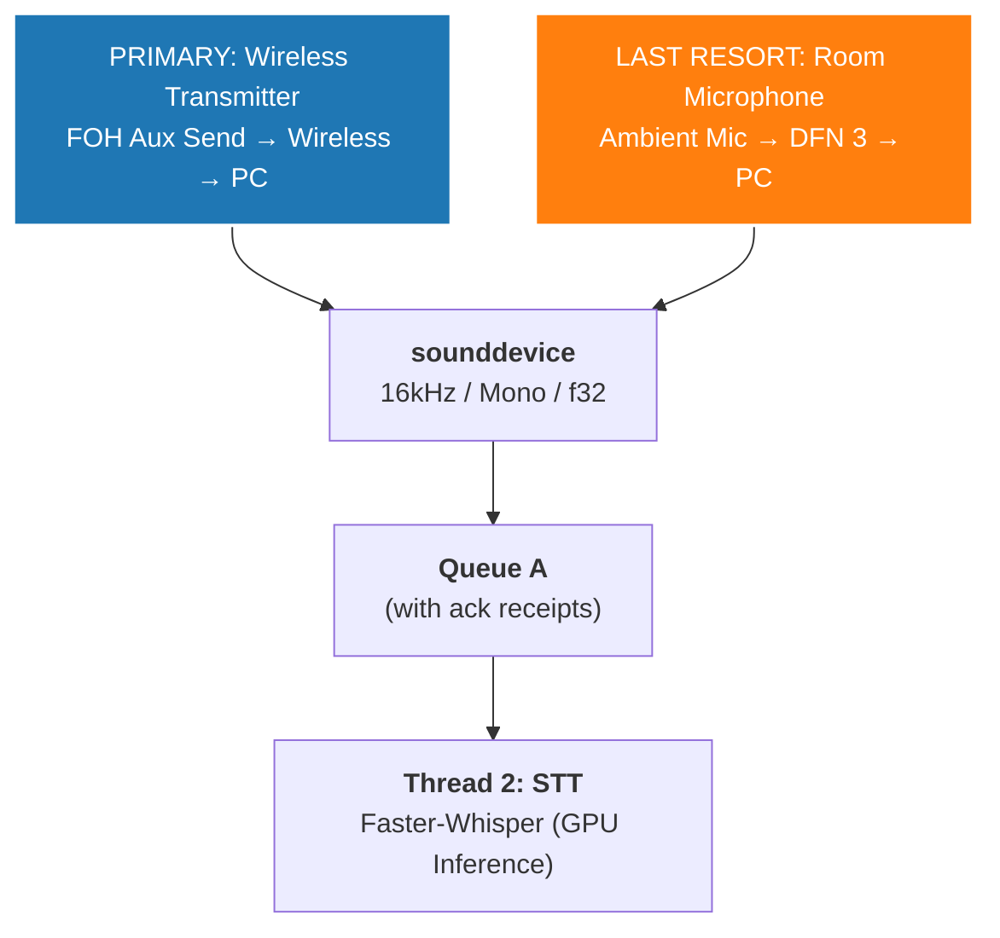

# Audio Ingestion Pipeline

This document specifies how Still captures, formats, and delivers the raw audio signal from the pastor's microphone to the STT inference engine.

---

## Ingestion Specifications

The audio capture thread (Thread 1) is hardcoded to ingest audio exactly as the Faster-Whisper model natively expects it. There is **no real-time downsampling or format conversion** in the Python layer — everything is handled at the hardware/driver level.

| Parameter | Value | Rationale |
|-----------|-------|-----------|
| **Sample rate** | 16,000 Hz (16 kHz) | Native expectation of Whisper's mel-spectrogram frontend |
| **Channel count** | 1 (Mono) | Whisper's architecture does not process stereo separation |
| **Bit depth** | 16-bit PCM equivalent | Captured as 32-bit float via `sounddevice` (see below) |
| **Float format** | 32-bit float, range -1.0 to 1.0 | Required by the inference engine; normalized at the hardware layer |

---

## Approved Python Library: `sounddevice`

### Why `sounddevice`?

The `sounddevice` library is mandated as the sole approved audio capture library. It wraps PortAudio (a mature C library) and provides a critical advantage over legacy alternatives like PyAudio:

**Zero-copy normalization.** By configuring the InputStream to capture `dtype='float32'`, the underlying PortAudio C library performs the 16-bit to 32-bit float conversion at the hardware layer. The audio data arrives in Python as a native NumPy array already normalized to the -1.0 to 1.0 range. This completely eliminates the heavy CPU overhead of mathematically dividing raw byte arrays in Python.

### Configuration

```python
import sounddevice as sd

SAMPLE_RATE = 16_000
CHANNELS = 1
DTYPE = 'float32'
BLOCK_SIZE = 1600  # 100ms of audio at 16kHz (configurable)

stream = sd.InputStream(
    samplerate=SAMPLE_RATE,
    channels=CHANNELS,
    dtype=DTYPE,
    blocksize=BLOCK_SIZE,
    device=TARGET_DEVICE_INDEX,  # Configured at startup
)
```

### Callback vs. Blocking Read

Two patterns are available:

| Pattern | Description | Recommended For |
|---------|-------------|-----------------|
| **Callback** | `sd.InputStream(callback=fn)` — PortAudio calls the function for every audio block on a dedicated C thread | Lowest latency; preferred for production |
| **Blocking** | `stream.read(frames)` — Python thread pulls audio blocks on demand | Simpler implementation; acceptable during prototyping |

For production, the **callback pattern** is recommended. The callback function should do minimal work — push the raw NumPy array directly into Queue A and return immediately. Heavy processing (inference, search) happens on downstream threads.

```python
def audio_callback(indata, frames, time_info, status):
    if status:
        log_warning(f"Audio status: {status}")
    queue_a.put(indata.copy())  # .copy() required — PortAudio reuses the buffer

stream = sd.InputStream(
    samplerate=SAMPLE_RATE,
    channels=CHANNELS,
    dtype=DTYPE,
    blocksize=BLOCK_SIZE,
    callback=audio_callback,
)
```

> [!WARNING]
> **Always `.copy()` the `indata` array in the callback.** PortAudio reuses the same underlying buffer for each callback invocation. If you push the raw `indata` reference into the queue, the buffer contents will be silently overwritten by the next audio block before the STT thread reads it. This causes subtle, intermittent transcription corruption that is extremely difficult to debug.

---

## Audio Source Priority

### Primary: Wireless Audio Transmission

Securing a clean, dedicated audio feed is the **primary objective**. A wireless transmitter provides signal isolation from the room acoustics and utilizes zero system compute.

| Component | Example Hardware | Role |
|-----------|-----------------|------|
| **Transmitter** | Rode Wireless PRO, Sennheiser IEM transmitter | Clips to the pastor or receives a direct feed from the FOH console |
| **Audio source** | Isolated Aux Send or Matrix output on the FOH mixing console | Provides a clean, unprocessed vocal signal without room ambience, effects, or music bleed |
| **Receiver** | Corresponding wireless receiver connected to the presentation computer's audio interface | Delivers the signal to `sounddevice` |

**Why FOH isolation matters:** A main mix output contains music, effects, congregation noise, and dynamic compression — all of which contaminate the STT input. An isolated Aux Send or Matrix routed pre-fader from the pastor's vocal channel provides the cleanest possible signal.

### Last Resort: DeepFilterNet 3 (DFN 3) Pre-Processing

If hardware budgeting for a wireless unit is denied and physical audio routing is impossible, room audio from an ambient microphone must be salvaged via software noise reduction.

| Property | Value |
|----------|-------|
| **Algorithm** | DeepFilterNet 3 (DFN 3) |
| **Implementation** | C++ plugin (not Python — avoids GIL contention) |
| **Signal chain** | Room audio → DFN 3 noise reduction → `sounddevice` → Queue A → STT |
| **Compute cost** | CPU only — no VRAM consumed |

> [!CAUTION]
> **Critical requirement:** If DFN 3 is used, the custom STT model must be **specifically fine-tuned on DFN 3's output** within the target church sanctuary. DFN 3 introduces characteristic processing artifacts (spectral smoothing, transient smearing) that a standard Whisper model has never seen. Without adaptation, transcription accuracy will degrade significantly. See [ai_models.md](ai_models.md) for details.

---

## Signal Chain Summary



---

## Device Selection

At startup, the application should enumerate available audio input devices via `sd.query_devices()` and either:

1. **Auto-select** the configured device index stored in the application settings, or
2. **Present a dropdown** in the operator UI listing all available input devices with their names, sample rate support, and channel counts.

The selected device index is passed as the `device` parameter to `sd.InputStream()`. If the configured device is unavailable (e.g., the wireless receiver is unplugged), the application should display a clear warning and prevent the operator from starting the transcription session.

---

## Cross-References

- **Audio format consumed by the STT model:** [ai_models.md](ai_models.md)
- **Queue A acknowledgment protocol:** [threading_and_lifecycle.md](threading_and_lifecycle.md)
- **Thread 1 in the threading model:** [architecture.md](architecture.md)
- **System hardware requirements:** [gpu_and_hardware.md](gpu_and_hardware.md)
