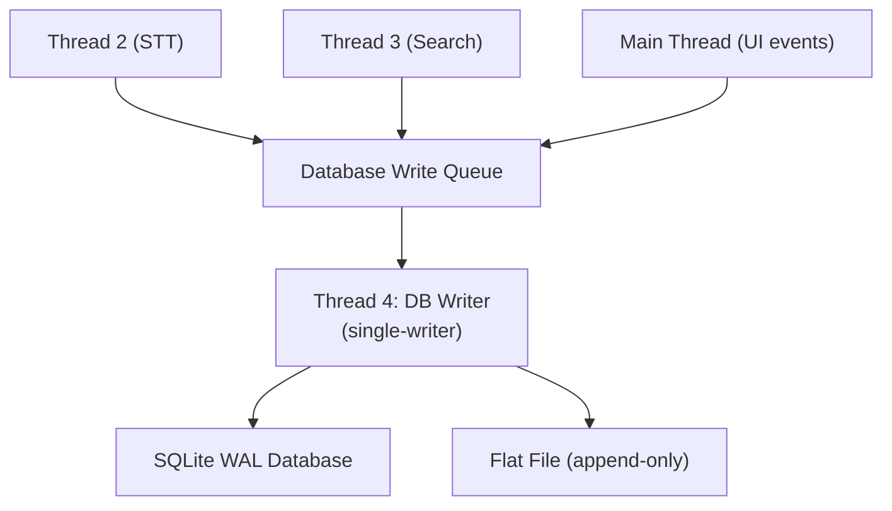

# Database and Storage

This document specifies how Still persists data during a live service, including the SQLite database architecture, the single-writer queue pattern, chronological reconstruction via monotonic sequence IDs, and the append-only flat file fail-safe.

---

## Architecture Overview

Still uses a **single SQLite database file** in WAL (Write-Ahead Logging) mode, guarded by a dedicated single-writer thread that serializes all inserts. A parallel append-only flat file provides a zero-overhead fail-safe for the raw transcript.



---

## SQLite WAL Mode

### Why WAL?

Enabling WAL (Write-Ahead Logging) mode provides two critical guarantees:

1. **Simultaneous read/write.** The operator's UI can freely query past verses and display history from the database without ever blocking incoming transcript writes by Thread 4.
2. **Non-blocking readers.** Unlike the default journal mode, WAL mode does not require readers to acquire a shared lock that would block the writer.

### Configuration

```python
import sqlite3

conn = sqlite3.connect('still_service.db')
conn.execute("PRAGMA journal_mode=WAL")
conn.execute("PRAGMA synchronous=NORMAL")  # Balanced durability vs speed
```

---

## The Single-Writer Queue Pattern

### The Problem

The continuous stream STT produces transcription events at high frequency. Multiple threads (STT, Search, UI) need to write data to the database. Allowing multiple threads to write directly causes `database is locked` errors, even in WAL mode, because SQLite only supports one concurrent writer.

### The Solution

**All threads are completely prohibited from writing to the database directly.** Instead, every thread pushes its data payload to a thread-safe `Database_Write_Queue`. A single, dedicated background thread (Thread 4: DB Writer) pulls items from this queue one at a time and executes the SQL inserts sequentially.

### Queue Ordering

- **FIFO execution.** The DB thread strictly processes payloads in the exact order they enter the queue. No sorting or prioritization is performed.
- **Microscopic tie-breaking.** If multiple threads push data within the same millisecond, the operating system's internal thread scheduler acts as the tie-breaker, guaranteeing sequential insertion into the queue.
- **Timestamps are for reconstruction, not priority.** Millisecond-precise timestamps are included in every payload, but they are used strictly for post-service data analysis and archival tracking — never for determining write order.

---

## Three-Stage Event Logging

Every critical action in the pipeline is treated as an independent event payload and pushed to the Database Write Queue:

| Stage | Producer | Event Type | Payload Contents |
|-------|----------|------------|-----------------|
| **Stage 1** | Thread 2 (STT) | Raw text output | Timestamp, sequence ID, session UUID, raw text chunk, buffer word count |
| **Stage 2** | Thread 3 (Search) | Search result metrics | Timestamp, sequence ID, source text, top verse reference, RRF raw score, confidence %, intent score, BM25 rank, FAISS rank |
| **Stage 3** | Main Thread / Thread 3 | UI/display state change | Timestamp, sequence ID, verse reference, action taken (auto-display / queued / discarded / operator-approved / operator-cleared) |

---

---

## Configuration Storage Architecture

Application settings and states are strictly segregated to prevent database bloat, state conflicts, and security risks:

1. **JSON Config (`config.json`)**: Stores static application state (e.g., UI defaults, theme CSS definitions). Edited by the system admin. Read exactly once at boot.
2. **SQLite `settings` table**: Stores user-toggled, active settings managed through the Operator UI (e.g., current active theme, current RRF confidence threshold). Read at boot, and updated safely via the single-writer Database Write Queue.
3. **`.env` File**: Strictly reserved for API keys (e.g., Gemini, Claude, Groq). Injected dynamically at runtime and never persisted to any table.

---

## Database Schema

### `transcripts` Table

Stores every raw STT text chunk produced during the service.

```sql
CREATE TABLE transcripts (
    id            INTEGER PRIMARY KEY AUTOINCREMENT,
    session_id    TEXT    NOT NULL,  -- Session UUID (e.g., "2026-04-16_AM")
    sequence_id   INTEGER NOT NULL,  -- Monotonically increasing per session
    timestamp_ms  INTEGER NOT NULL,  -- Unix epoch milliseconds
    text_chunk    TEXT    NOT NULL,  -- The raw 15-word (or partial) text block
    word_count    INTEGER NOT NULL,  -- Actual word count (may be < 15 for TTL flush)
    UNIQUE(session_id, sequence_id)
);
```

### `search_results` Table

Logs every search evaluation for forensic analysis and threshold tuning.

```sql
CREATE TABLE search_results (
    id              INTEGER PRIMARY KEY AUTOINCREMENT,
    session_id      TEXT    NOT NULL,
    sequence_id     INTEGER NOT NULL,  -- Links to the originating transcript chunk
    timestamp_ms    INTEGER NOT NULL,
    source_text     TEXT    NOT NULL,
    top_verse_ref   TEXT,              -- e.g., "John 3:16"
    rrf_raw_score   REAL,
    confidence_pct  REAL,              -- 0.0 to 100.0
    intent_score    TEXT,              -- "high", "medium", "low"
    bm25_rank       INTEGER,           -- Rank in BM25 lane (NULL if absent)
    faiss_rank      INTEGER,           -- Rank in FAISS lane (NULL if absent)
    action_taken    TEXT NOT NULL,      -- "auto_display", "queued", "discarded"
    FOREIGN KEY (session_id, sequence_id) REFERENCES transcripts(session_id, sequence_id)
);

> [!CAUTION]
> **Offline Indexing Integrity:** To guarantee the BM25 `source_text` matches the offline Bible indexes, the exact punctuation stripping map (stripping apostrophes, converting hyphens/slashes to spaces) is enforced symmetrically during both the offline FAISS/BM25 database building and live search execution.
```

### `display_events` Table

Tracks every verse that reached the broadcast output or operator queue.

```sql
CREATE TABLE display_events (
    id            INTEGER PRIMARY KEY AUTOINCREMENT,
    session_id    TEXT    NOT NULL,
    timestamp_ms  INTEGER NOT NULL,
    verse_ref     TEXT    NOT NULL,
    translation   TEXT    NOT NULL,     -- e.g., "KJV", "NIV"
    theme_id      TEXT,                 -- Active display theme
    trigger_type  TEXT    NOT NULL,     -- "auto", "operator_approved", "manual_override"
    confidence_pct REAL,
    displayed_at  INTEGER,             -- Timestamp when actually shown on screen
    cleared_at    INTEGER              -- Timestamp when cleared from screen
);
```

### `sessions` Table

Metadata for each service session.

```sql
CREATE TABLE sessions (
    session_id    TEXT PRIMARY KEY,     -- e.g., "2026-04-16_AM"
    started_at    INTEGER NOT NULL,     -- Unix epoch ms
    ended_at      INTEGER,             -- NULL until service ends
    audio_source  TEXT,                 -- "wireless", "dfn3_room"
    notes         TEXT                  -- Operator notes
);
```

---

## Monotonically Increasing Sequence IDs

### The Problem

Millisecond Unix epoch timestamps cannot guarantee perfect sequence reconstruction. The STT engine running on parallel threads can produce multiple overlapping chunk outputs within the same 1-millisecond window, creating identical timestamps that produce arbitrary, unpredictable tie-breaks during `ORDER BY timestamp` queries.

### The Solution

The STT thread assigns a **localized, auto-incrementing integer** (Sequence ID) to every text payload before it enters the queue:

```python
sequence_counter = 0

def push_to_queue(text_chunk, session_id):
    global sequence_counter
    sequence_counter += 1
    payload = {
        'session_id': session_id,
        'sequence_id': sequence_counter,
        'timestamp_ms': int(time.time() * 1000),
        'text_chunk': text_chunk,
    }
    db_write_queue.put(payload)
```

### Session Resumption & Composite Keys

The Sequence ID resets to 1 on every fresh application boot. To prevent collisions across services stored in the same database and to handle mid-service application crashes seamlessly:

1. **Phase 1 Interruption Gate:** During initialization, the system queries the `sessions` table strictly for any row where `ended_at IS NULL`. The arbitrary 4-hour crash-stitching window is deprecated.
2. If an open session is found, a **blocking UI prompt** forces the operator to make a choice:
   - **"Resume":** The application re-adopts that exact Session UUID (e.g., `2026-04-16_AM`). To maintain monotonic sequencing, the system sets the local counter: `sequence_counter = MAX(sequence_id) + 1` from the `transcripts` table for that session.
   - **"Start New":** The system closes the old session, generates a new Session UUID, and `sequence_counter` starts at 1.

This deterministic session stitching guarantees an unbroken sequence ID chain under a single session UUID, requiring zero changes to the LLM monolithic payload logic if the software crashes and is restarted mid-service.

#### Reconstruction Scoping

Every payload includes both the Session UUID and the Sequence ID. The reconstruction query is scoped to the session:

```sql
SELECT text_chunk 
FROM transcripts 
WHERE session_id = '2026-04-16_AM' 
ORDER BY sequence_id ASC;
```

This ensures perfect historical isolation while allowing the local counter to safely reset on boot.

---

## Append-Only Flat File Fail-Safe

### Why?

While SQLite WAL mode is highly robust, a sudden power loss during an active database commit can occasionally corrupt the database file index. The flat file guarantees that the raw sermon transcript survives even in this worst case.

### Specifications

| Property | Value |
|----------|-------|
| **Writer** | Thread 4 (DB Writer) — writes simultaneously with the SQL insert |
| **Format** | Plain text, append-only |
| **Method** | OS native stream writer (`open(path, 'a')`) |
| **Compute overhead** | Virtually zero — no indexing, no parsing |

### Strict Directory Isolation

> [!CAUTION]
> **The file must never be saved in standard user directories** (Desktop, Documents, Downloads). Background cloud sync agents (OneDrive, Google Drive) will lock these files to upload them, triggering recursive `PermissionError` exceptions on backup file generation that instantly kill the DB Writer thread.

OS-level file locking is bypassed entirely by programmatically forcing the log path to system-level application data directories. Cloud sync agents do not monitor system-level directories, permanently eliminating the external lock vector.

| Property | Convention |
|----------|-----------|
| **Directory** | Isolated application data path (`C:\ProgramData\Still\Logs\` on Windows, `/var/lib/still/logs/` on Linux) |
| **Filename** | ISO 8601 format: `YYYY-MM-DD_HH-MM-SS_raw_stt.log` |
| **Example** | `2026-04-16_09-30-00_raw_stt.log` |

### Failover on Concurrent Lock (Fallback)

While sync agents are structurally avoided, if an anti-virus or other rogue process places an exclusive lock on the active `.log` file:

1. The `write()` call throws a `PermissionError`.
2. Thread 4 catches the exception and immediately closes the file handle.
3. A new file is generated with an incremented suffix: `..._raw_stt_PART2.log`.
4. Text is appended to the new file.
5. A **UI warning** is triggered to alert the operator.

```python
try:
    log_file.write(f"{timestamp} | {text_chunk}\n")
    log_file.flush()
except PermissionError:
    log_file.close()
    part_number += 1
    log_file = open(f"{base_name}_PART{part_number}.log", 'a')
    log_file.write(f"{timestamp} | {text_chunk}\n")
    ui_queue.put({"warning": "Log file locked by external process. New file created."})
```

---

## Post-Service Reconstruction

### Transcript Stitching

After the service ends (Phase 3), the complete transcript is reconstructed by querying the `transcripts` table:

```sql
SELECT text_chunk 
FROM transcripts 
WHERE session_id = ? 
ORDER BY sequence_id ASC;
```

The resulting chunks are concatenated with overlap-aware joining. Because the sliding window retains a 6-word overlap, the reconstruction algorithm must deduplicate the trailing overlap from each consecutive chunk pair to produce a clean, continuous transcript. A simple implementation:

```python
def stitch_transcript(chunks):
    if not chunks:
        return ""
    result = chunks[0]
    for chunk in chunks[1:]:
        # Skip the first 6 words (overlap from previous chunk)
        words = chunk.split()
        if len(words) > 6:
            result += " " + " ".join(words[6:])
        # If chunk is <= 6 words, it's entirely overlap — skip
    return result
```

### Forensic Audit Trail

The `search_results` table provides a complete audit trail for tuning confidence thresholds:

```sql
-- Find all false positives: auto-displayed verses with low actual relevance
SELECT source_text, top_verse_ref, confidence_pct, intent_score
FROM search_results
WHERE session_id = ?
  AND action_taken = 'auto_display'
ORDER BY confidence_pct ASC;
```

---

## Cross-References

- **Database Write Queue in the threading model:** [architecture.md](architecture.md)
- **Thread 4 teardown protocol:** [threading_and_lifecycle.md](threading_and_lifecycle.md)
- **Sequence ID assignment by the STT thread:** [architecture.md](architecture.md)
- **Cloud extraction of reconstructed transcript:** [cloud_pipeline.md](cloud_pipeline.md)
