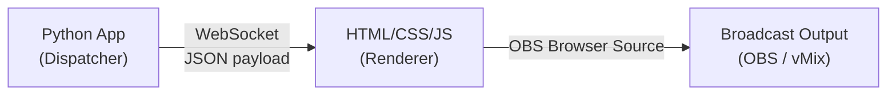

# Display and Broadcast

This document specifies how Still renders scripture text and delivers it to the broadcast software (OBS/vMix) for live display to the congregation.

---

## Architecture: The WebSocket/HTML Pivot

> [!IMPORTANT]
> **The Python application is NOT a pixel renderer.** An earlier design proposed rendering uncompressed 1920×1080 RGBA frames in Python and pushing them over NDI. This approach was abandoned because:
> 1. Continuously pushing uncompressed RGBA video frames through a Python NDI wrapper causes severe CPU bottlenecking.
> 2. Any Python-side rendering library (PyQt, OpenCV) would fight the STT model for GPU VRAM or saturate the CPU.
>
> The production architecture shifts all graphical compute to the broadcast software's built-in rendering engine.

### The Three Components



---

## Component 1: The Python Dispatcher

When the search pipeline (Phase 5) triggers an auto-display or the operator manually approves a verse, Python packages the display data into a minimal JSON payload and pushes it over a local WebSocket connection.

### WebSocket Server

During Phase 1 (Initialization), Python starts a lightweight WebSocket server on a local port:

```python
import asyncio
import websockets

connected_clients = set()

async def handler(websocket, path):
    connected_clients.add(websocket)
    try:
        async for message in websocket:
            pass  # Client doesn't send messages; this is one-way
    finally:
        connected_clients.discard(websocket)

async def start_server():
    server = await websockets.serve(handler, "localhost", 8765)
    await server.wait_closed()
```

### Display Payload Schema

The JSON payload pushed over the WebSocket is intentionally microscopic:

```json
{
  "action": "display",
  "ref": "John 3:16",
  "text": "For God so loved the world, that he gave his only begotten Son, that whosoever believeth in him should not perish, but have everlasting life.",
  "translation": "KJV",
  "theme": "default"
}
```

| Field | Type | Description |
|-------|------|-------------|
| `action` | string | `"display"` to show a verse, `"clear"` to remove the current display, `"update_theme"` to change visual styling |
| `ref` | string | Full scripture reference (Book Chapter:Verse) |
| `text` | string | The complete verse text in the active translation |
| `translation` | string | Translation abbreviation (e.g., "KJV", "NKJV", "NIV") |
| `theme` | string | Active visual theme ID (maps to a CSS class in the renderer) |

### Clear Payload

When the operator clears the screen or the display timer expires:

```json
{
  "action": "clear"
}
```

### Sending to All Clients

```python
async def broadcast_display(payload: dict):
    message = json.dumps(payload)
    if connected_clients:
        await asyncio.gather(
            *[client.send(message) for client in connected_clients]
        )
```

---

## Component 2: The HTML/CSS/JS Renderer

A static HTML file acts as the WebSocket client. It receives JSON payloads and updates the DOM to render the scripture text. All visual styling is handled natively by CSS.

### Base HTML Structure

```html
<!DOCTYPE html>
<html lang="en">
<head>
  <meta charset="UTF-8">
  <meta name="viewport" content="width=device-width, initial-scale=1.0">
  <title>Still — Scripture Display</title>
  <link rel="stylesheet" href="themes.css">
</head>
<body>
  <div id="scripture-container" class="hidden">
    <p id="verse-text"></p>
    <p id="verse-ref"></p>
    <p id="verse-translation"></p>
  </div>

  <script src="display.js"></script>
</body>
</html>
```

### JavaScript Client

```javascript
const WS_URL = 'ws://localhost:8765';
let socket;

function connect() {
  socket = new WebSocket(WS_URL);
  
  socket.onmessage = (event) => {
    const data = JSON.parse(event.data);
    
    switch (data.action) {
      case 'display':
        showVerse(data);
        break;
      case 'clear':
        clearDisplay();
        break;
      case 'update_theme':
        setTheme(data.theme);
        break;
    }
  };
  
  socket.onclose = () => {
    // Auto-reconnect after 2 seconds
    setTimeout(connect, 2000);
  };
}

function showVerse(data) {
  const container = document.getElementById('scripture-container');
  document.getElementById('verse-text').textContent = data.text;
  document.getElementById('verse-ref').textContent = data.ref;
  document.getElementById('verse-translation').textContent = data.translation;
  
  // Apply theme via CSS class swap
  container.className = `theme-${data.theme}`;
  
  // Animate in
  container.classList.add('visible');
  container.classList.remove('hidden');
}

function clearDisplay() {
  const container = document.getElementById('scripture-container');
  container.classList.add('hidden');
  container.classList.remove('visible');
}

function setTheme(themeId) {
  const container = document.getElementById('scripture-container');
  // Remove all theme-* classes, add the new one
  container.className = container.className.replace(/theme-\S+/g, '');
  container.classList.add(`theme-${themeId}`);
}

connect();
```

### Theme System (CSS)

Visual themes are implemented as CSS classes. Switching themes requires zero JavaScript DOM manipulation beyond a single class swap — fonts, kerning, colors, drop-shadows, and animations are all handled natively by the browser's CSS engine.

```css
/* Base styles */
#scripture-container {
  position: fixed;
  bottom: 10%;
  left: 50%;
  transform: translateX(-50%);
  text-align: center;
  max-width: 80%;
  transition: opacity 0.5s ease, transform 0.3s ease;
}

#scripture-container.hidden {
  opacity: 0;
  transform: translateX(-50%) translateY(20px);
  pointer-events: none;
}

#scripture-container.visible {
  opacity: 1;
  transform: translateX(-50%) translateY(0);
}

/* Theme: Default */
.theme-default #verse-text {
  font-family: 'Georgia', serif;
  font-size: 3rem;
  color: #ffffff;
  text-shadow: 2px 2px 8px rgba(0, 0, 0, 0.8);
  line-height: 1.4;
}

.theme-default #verse-ref {
  font-family: 'Arial', sans-serif;
  font-size: 1.5rem;
  color: #cccccc;
  margin-top: 0.5em;
}

/* Theme: Communion */
.theme-communion #verse-text {
  font-family: 'Palatino', serif;
  font-size: 2.8rem;
  color: #f5e6d3;
  text-shadow: 1px 1px 6px rgba(0, 0, 0, 0.6);
  letter-spacing: 0.02em;
}

/* Theme: Prophetic */
.theme-prophetic #verse-text {
  font-family: 'Cinzel', serif;
  font-size: 3.2rem;
  color: #ffd700;
  text-shadow: 0 0 20px rgba(255, 215, 0, 0.4);
  font-weight: bold;
}
```

> [!TIP]
> New themes are created by adding CSS classes — no code changes required. The system admin can add custom themes by editing `themes.css` and referencing the theme ID in the application settings.

---

## Component 3: Broadcast Ingestion

### OBS Studio Configuration

1. **Add a Browser Source** to your scene.
2. **URL:** Point to the local HTML file (e.g., `file:///path/to/still/display.html`) or serve it via a local HTTP server (`http://localhost:8080/display.html`).
3. **Resolution:** 1920×1080 (match your output resolution).
4. **Custom CSS:** Leave empty — all styling is in `themes.css`.
5. **Transparency:** The Browser Source renders with a transparent background by default. The scripture text floats over whatever is beneath it in the OBS scene.

### vMix Configuration

1. Add a **Web Browser Input**.
2. Point to the same URL.
3. Layer it above your camera/media sources.

### Video Backgrounds

> [!IMPORTANT]
> **Looping video backgrounds must be completely decoupled from the text rendering.** Do NOT attempt to decode video files within the Browser Source or the Python application.

The correct approach:

1. **Bottom layer (OBS):** A standard **Media Source** playing a looping MP4/WebM motion background.
2. **Top layer (OBS):** The transparent **Browser Source** displaying the scripture text via the WebSocket/HTML pipeline.

OBS composites these two layers using its internal, hardware-accelerated rendering engine. The Python application has zero awareness of or interaction with the video background.

---

## Display Routing Summary

| Source | Trigger | Flow |
|--------|---------|------|
| **Auto-Display** | Confidence ≥ 85% + High/Medium Intent | Search Thread → `broadcast_display()` → WebSocket → HTML → OBS |
| **Operator Approval** | Operator clicks "Display" on a queued verse | UI Thread → `broadcast_display()` → WebSocket → HTML → OBS |
| **Manual Override** | Operator types a verse reference and clicks "Show" | UI Thread → `broadcast_display()` → WebSocket → HTML → OBS |
| **Clear Screen** | Operator clicks "Clear" or display timer expires | UI Thread → `broadcast_display({"action": "clear"})` → WebSocket → HTML → OBS |

---

## Historical Note: The Original NDI RGBA Approach

The original architecture (documented in `questions.md` Q18) proposed having Python render scripture onto a transparent 1920×1080 canvas, convert it to raw RGBA byte arrays, and push uncompressed video frames through the NDI SDK (`ndi-python`). This was abandoned in `questions.md` Q23 due to:

- **CPU bottleneck:** Continuous 1920×1080 RGBA frame encoding in Python saturates the CPU.
- **VRAM contention:** Any GPU-accelerated UI renderer (PyQt with OpenGL, etc.) would compete with the STT model for the 4 GB VRAM budget.
- **Unnecessary complexity:** The broadcast software (OBS/vMix) already contains a highly optimized, hardware-accelerated Chromium engine (Browser Source) that performs this rendering for free.

The WebSocket/HTML pivot eliminates all three problems by shifting graphical compute entirely to the broadcast software.

---

## Cross-References

- **Search pipeline display decision:** [search_engine.md](search_engine.md)
- **Thread architecture and WebSocket server:** [architecture.md](architecture.md)
- **Operator controls:** [README.md](README.md)
