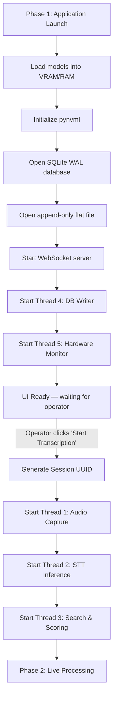
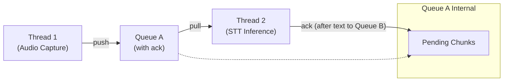

# Threading and Lifecycle Management

This document specifies how RhemaCast manages thread startup, runtime synchronization, failover transitions, and safe shutdown procedures.

---

## Thread Inventory

| Thread | Purpose | Started At | Stopped At |
|--------|---------|-----------|-----------|
| **Main Thread** | UI rendering, operator controls, lifecycle orchestration | Application launch | Application exit |
| **Thread 1 — Audio Capture** | Captures 16kHz/mono/float32 PCM audio, pushes to Queue A | "Start Transcription" clicked | Poison pill received or service ends |
| **Thread 2 — STT Inference** | Pulls from Queue A, runs Faster-Whisper, pushes text to Queue B | "Start Transcription" clicked | Poison pill received from Queue A |
| **Thread 3 — Search & Scoring** | Pulls from Queue B, runs BM25 + FAISS, routes display decisions | "Start Transcription" clicked | Poison pill received from Queue B |
| **Thread 4 — DB Writer** | Pulls from Database Write Queue, executes SQL inserts, writes flat file | Phase 1 Initialization | Poison pill received from DB Queue; commits WAL and closes connection |
| **Thread 5 — Hardware Monitor** | Polls GPU temperature via pynvml, throttles/restores power | Phase 1 Initialization | Service flag set to `False` |
| **WebSocket Server** | Pushes display payloads to HTML renderer | Phase 1 Initialization | Application exit |

> [!NOTE]
> **Service Manager:** `core/service_manager.py` is the central authority managing all thread lifecycles with explicit states: `BOOTING`, `READY`, `RUNNING`, `DEGRADED`, `FAILOVER`, `SHUTTING_DOWN`, `CRASHED`. The service manager handles boot sequencing (T4 → T5 → T1 → T2 → T3), thread registration with heartbeats, graceful shutdown via sequential poison pills with timeouts, crash escalation, and restart policies (e.g., restart Thread 2 up to 3 times before permanent failover).

---

## Startup Sequence

Thread startup follows a strict dependency order to prevent race conditions:



### Why This Order?

1. **Thread 4 (DB Writer) starts before audio threads** — ensures the database is ready to receive event payloads the instant transcription begins.
2. **Thread 5 (Hardware Monitor) starts before GPU threads** — ensures thermal monitoring is active before the GPU begins processing inference workloads.
3. **Thread 1 → Thread 2 → Thread 3** — each thread in the audio pipeline starts in producer-before-consumer order to prevent consumers from polling empty queues.

> [!NOTE]
> **Lazy Tab Loading:** UI tabs beyond the Presentation tab are NOT part of the critical startup path. They are deferred and initialized lazily — their assets and logic load only when the operator clicks on them for the first time. This reduces Phase 1 initialization time by skipping non-essential UI rendering. See [architecture.md](architecture.md) for details.

---

## Queue Acknowledgment Receipt Protocol

### The Problem

When the GPU overheats catastrophically and the Faster-Whisper STT thread must be killed, any un-transcribed audio chunks currently held in Thread 2's local memory are destroyed. Simply killing the thread causes data loss.

### The Solution

Queue A implements a strict **acknowledgment receipt protocol**:



### Execution

1. **Thread 1 pushes** an audio chunk to Queue A.
2. **Thread 2 pulls** the chunk from Queue A. The chunk transitions to a **"pending"** state — it is NOT yet purged.
3. **Thread 2 processes** the audio through Faster-Whisper and generates text.
4. **Thread 2 pushes** the resulting text to Queue B.
5. **Thread 2 acknowledges** the chunk. Only now is the chunk purged from Queue A's pending state.

### Latency-Triggered Failover & Queue Draining

An initial assumption was that if the GPU throttles and inference runs slower than real-time, standard RAM would eventually run Out of Memory (OOM) due to Queue A backing up. However, 16kHz mono 32-bit float audio generates exactly 64 KB/sec. One hour of backlog is ~230 MB. RAM OOM is mathematically impossible. The actual danger is **Latency Drift**—the broadcast text falling minutes behind the live pastor.

To prevent drift, Queue A enforces latency memory bounds:

1. **Queue A Bounds:** Queue A is monitored for size limits. At 100ms block sizes, a queue depth of 400 items equates to exactly 40 seconds of transcription lag.
2. **Compute Failure:** If Queue A exceeds 400 items, the system declares a Compute Failure. The Main Thread flips an OS-level event flag to unblock the fallback thread.

**Refined Compute Failure detection:** Thread 2 increments a counter each time it processes a chunk. A watchdog thread checks the counter; if stalled for > 2 seconds while audio is incoming, declare Compute Failure. When Compute Failure occurs: pause audio capture (set flag in Thread 1 to stop pushing new chunks), replay pending unacknowledged chunks to Vosk, then resume capture.

#### Failover Replay Sequence (Supervisor Pattern)

When Failover is triggered:

1. **The Pivot:** The system flags all **unacknowledged audio chunks** as pending. Thread 2 (GPU) is halted.
2. **Phase 1 Initialization:** The Vosk model (`vosk-model-small-en-us`) is already loaded into standard RAM, and Thread 2-Fallback was spawned during Phase 1 but blocked by an OS-level event flag (consuming 0 CPU cycles). Transition spin-up time is exactly 0 milliseconds when the flag is flipped.
3. **CPU Starvation Prevention:** To prevent Vosk from monopolizing the CPU while draining the backlog and starving the Search/Database threads:
   - OpenBLAS/MKL threads are hard-capped via environment variables (`OMP_NUM_THREADS`, etc.) during Phase 1.
   - The drain loop explicitly yields to the OS scheduler (`time.sleep(0.01)`) between chunks.
4. **Queue Draining:** Thread 1 continues pushing audio chunks. Vosk burns through the unacknowledged chunks safely, preventing any dropped audio.

> [!NOTE]
> The acknowledgment protocol adds minimal overhead during normal operation (a simple state flag toggle). Its cost is justified entirely by the zero-data-loss guarantee during GPU failover events.

---

## Thread Teardown: Sequential Poison Pills

### The Problem

Threads interacting with the SQLite database cannot be force-killed. A `thread.kill()` or `os.kill()` during an active SQL insert can corrupt the WAL file. A forced kill during a FAISS distance calculation can leave memory in an inconsistent state.

### The Solution: Sequential Poison Pills

When the operator clicks "End Service," the main thread initiates a clean, cascading shutdown using **sentinel objects** (poison pills) passed through the same queues the threads consume:

```mermaid
graph LR
    Main["Main Thread"] -->|"Poison pill"| QA["Queue A"]
    QA --> T1["Thread 1: Audio Capture"]
    T1 -->|"Detects pill → stops capturing → pushes pill to Queue A for Thread 2"| QA2["Queue A"]
    QA2 --> T2["Thread 2: STT"]
    T2 -->|"Detects pill → pushes pill"| QB["Queue B"]
    QB --> T3["Thread 3: Search"]
    T3 -->|"Detects pill → pushes pill"| DBQ["DB Write Queue"]
    DBQ --> T4["Thread 4: DB Writer"]
    T4 -->|"Commits WAL → closes connection → exits"| Done["Clean Exit"]
```



### Detailed Sequence

1. **Main thread** pushes a sentinel `POISON_PILL` object into Queue A.
2. **Thread 1 (Audio Capture)** detects the pill. It stops the `sounddevice` InputStream, pushes a pill to Queue A (for Thread 2), and exits.
3. **Thread 2 (STT Inference)** processes any remaining audio in Queue A, detects the pill, pushes a pill to Queue B, and exits.
4. **Thread 3 (Search & Scoring)** processes any remaining text in Queue B, detects the pill, pushes a pill to the Database Write Queue, and exits.
5. **Thread 4 (DB Writer)** processes all remaining event payloads in the DB Write Queue, detects the pill, commits the WAL file (`conn.execute("PRAGMA wal_checkpoint(FULL)")`), closes the database connection, closes the flat file handle, and exits cleanly.
6. **Thread 5 (Hardware Monitor)** reads the `service_active` flag (set to `False` by the main thread) and exits on its next poll cycle.

### Poison Pill Implementation

```python
POISON_PILL = object()  # Unique sentinel — identity comparison, not equality

# In Thread 2's main loop:
while True:
    item = queue_a.get()
    if item is POISON_PILL:
        queue_b.put(POISON_PILL)
        break
    # ... normal processing ...
```

### Operational Modes

The operational modes affect thread behavior as follows:

| Mode | Effect |
|------|--------|
| `NORMAL` | Full pipeline — all threads active |
| `SAFE_MODE` | Disables FAISS and cloud-dependent features |
| `CPU_ONLY` | Disables GPU monitoring (Thread 5 skips pynvml) |
| `REHEARSAL` | Reads from a pre-recorded WAV file instead of microphone; disables broadcast output |
| `HEADLESS` | Runs without UI; all state transitions logged to console |
| `DEBUG` | Enables verbose per-thread logging and extended heartbeat intervals |
| `BENCHMARK` | Runs the pipeline against a replay corpus with throughput/latency metrics |

---

## Error Propagation

When an error occurs in a downstream thread, it must not silently die. Each thread should catch exceptions, log the error, push a diagnostic event to the Database Write Queue, and — depending on severity — either:

1. **Continue** (transient error, e.g., a single embedding model timeout) 
2. **Trigger degradation** (e.g., embedding model fails → fall back to BM25-only search)
3. **Signal failover** (e.g., GPU crash → initialize Vosk, replay unacknowledged chunks)
4. **Push poison pill and exit** (e.g., unrecoverable exception → cascade shutdown)

```python
# In Thread 3's main loop:
while True:
    try:
        item = queue_b.get()
        if item is POISON_PILL:
            db_write_queue.put(POISON_PILL)
            break
        process_search(item)
    except TransientError as e:
        log_warning(f"Transient error in search: {e}")
        db_write_queue.put({"event": "error", "thread": "search", "error": str(e)})
        continue
    except FatalError as e:
        log_critical(f"Fatal error in search: {e}")
        db_write_queue.put({"event": "fatal_error", "thread": "search", "error": str(e)})
        db_write_queue.put(POISON_PILL)
        break
```

---

## Error Propagation Patterns

The system defines four error responses, each with distinct semantics:

| Response | Description |
|----------|-------------|
| **Continue** | Transient error — log and proceed without state change |
| **Degrade** | Non-critical component fails — fall back to a simpler model or trigger-based logic (e.g., embedding model fails → `intent_triggers.json`) |
| **Failover** | Critical component fails — switch to a backup pipeline (e.g., GPU crash → Vosk) |
| **Shutdown** | Unrecoverable error — cascade poison pills through all queues and terminate |

These patterns compose hierarchically: a thread may attempt Continue, escalate to Degrade if errors persist, then to Failover, and finally to Shutdown.

---

## Cross-Platform Threading Notes

The threading architecture is fully portable between Windows and Linux:

- **Python `threading` module** behaves identically on both platforms (same GIL semantics, same `Thread` API, same `queue.Queue` implementation).
- **No POSIX signals used.** The architecture deliberately avoids `os.kill()` and POSIX signal handling (which differ significantly on Windows). Instead, the **poison pill pattern** provides clean, cross-platform thread teardown via queue-based sentinel objects. This is an architectural win for portability.
- **`time.sleep()` precision** differs slightly between Windows (~15ms granularity) and Linux (~1ms granularity), but this has no functional impact — the polling intervals (2–5 seconds for Thread 5) and queue timeouts are orders of magnitude larger.

---

## Rehearsal Mode & Deterministic Replay

A **UI toggle** reads a pre-recorded 16kHz WAV file and pushes it into Queue A as if from the microphone, enabling offline testing of the full pipeline without live audio.

For diagnostics, raw Queue A audio stream is recorded to `.pcm` with timestamps during live services. The **Replay Session System** feeds recorded `.pcm` back into the pipeline offline, captures all thread outputs, and compares them against a golden baseline to detect regressions.

---

## Cross-References

- **Thread roles in the architecture:** [architecture.md](architecture.md)
- **Queue A audio format:** [audio_ingestion.md](audio_ingestion.md)
- **GPU throttling (Thread 5):** [gpu_and_hardware.md](gpu_and_hardware.md)
- **Vosk failover model specs:** [ai_models.md](ai_models.md)
- **Database Write Queue and teardown:** [database_and_storage.md](database_and_storage.md)
- **Poison pill timeline in service lifecycle:** [architecture.md](architecture.md)
- **Cross-platform development strategy:** [architecture.md](architecture.md)
