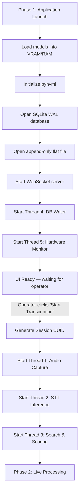
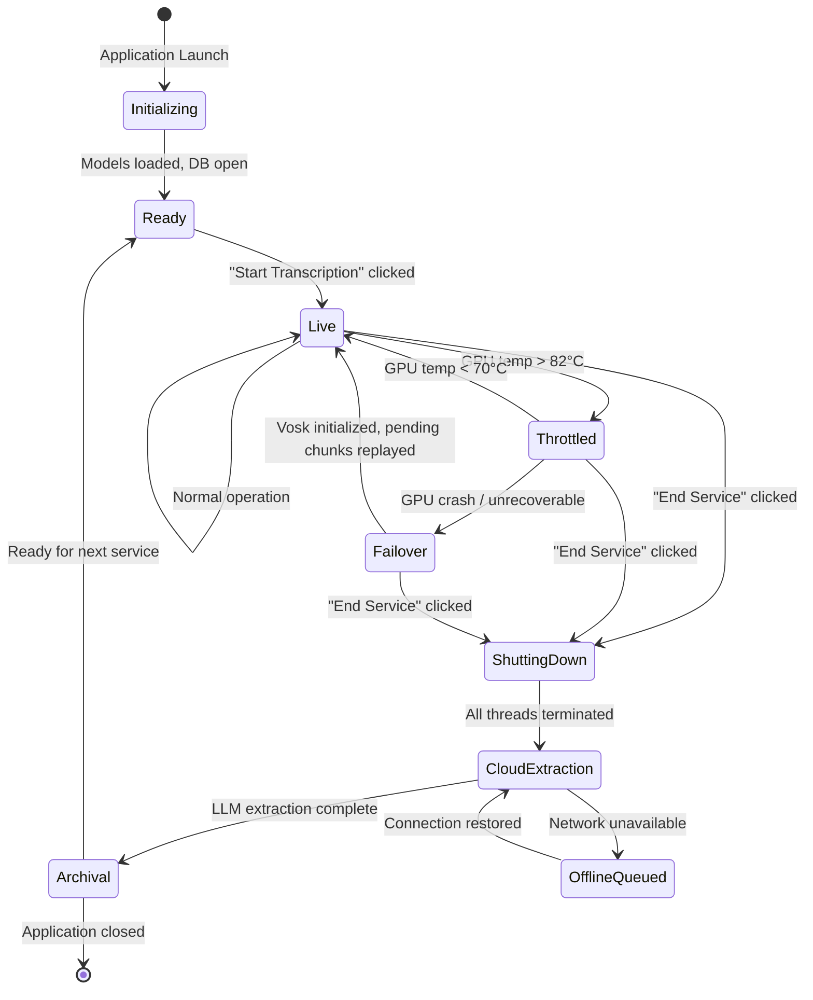

# Threading and Lifecycle Management

This document specifies how Still manages thread startup, runtime synchronization, failover transitions, and safe shutdown procedures.

---

## Thread Inventory

| Thread | Purpose | Started At | Stopped At |
|--------|---------|-----------|-----------|
| **Main Thread** | UI rendering, operator controls, lifecycle orchestration | Application launch | Application exit |
| **Thread 1 — Audio Capture** | Captures 16kHz/mono/float32 PCM audio, pushes to Queue A | "Start Transcription" clicked | Poison pill received or service ends |
| **Thread 2 — STT Inference** | Pulls from Queue A, runs Faster-Whisper, pushes text to Queue B | "Start Transcription" clicked | Poison pill received from Queue A |
| **Thread 3 — Search & Scoring** | Pulls from Queue B, runs BM25 + FAISS, routes display decisions | "Start Transcription" clicked | Poison pill received from Queue B |
| **Thread 4 — DB Writer** | Pulls from Database Write Queue, executes SQL inserts, writes flat file | Phase 1 Initialization | Poison pill received from DB Queue; commits WAL and closes connection |
| **Thread 5 — Hardware Monitor** | Polls GPU temperature via pynvml, throttles/restores power | Phase 1 Initialization | Service flag set to `False` |
| **WebSocket Server** | Pushes display payloads to HTML renderer | Phase 1 Initialization | Application exit |

---

## Startup Sequence

Thread startup follows a strict dependency order to prevent race conditions:



### Why This Order?

1. **Thread 4 (DB Writer) starts before audio threads** — ensures the database is ready to receive event payloads the instant transcription begins.
2. **Thread 5 (Hardware Monitor) starts before GPU threads** — ensures thermal monitoring is active before the GPU begins processing inference workloads.
3. **Thread 1 → Thread 2 → Thread 3** — each thread in the audio pipeline starts in producer-before-consumer order to prevent consumers from polling empty queues.

---

## Queue Acknowledgment Receipt Protocol

### The Problem

When the GPU overheats catastrophically and the Faster-Whisper STT thread must be killed, any un-transcribed audio chunks currently held in Thread 2's local memory are destroyed. Simply killing the thread causes data loss.

### The Solution

Queue A implements a strict **acknowledgment receipt protocol**:

```
┌──────────────┐         ┌─────────────────┐         ┌──────────────┐
│  Thread 1     │  push   │    Queue A       │  pull   │  Thread 2     │
│  Audio Capture│ ──────► │  (with ack)      │ ──────► │  STT Inference│
└──────────────┘         │                  │         └──────┬───────┘
                         │  ┌────────────┐  │                │
                         │  │ Pending    │  │     ack        │
                         │  │ Chunks     │◄─┼────────────────┘
                         │  └────────────┘  │  (after text pushed to Queue B)
                         └─────────────────┘
```

### Execution

1. **Thread 1 pushes** an audio chunk to Queue A.
2. **Thread 2 pulls** the chunk from Queue A. The chunk transitions to a **"pending"** state — it is NOT yet purged.
3. **Thread 2 processes** the audio through Faster-Whisper and generates text.
4. **Thread 2 pushes** the resulting text to Queue B.
5. **Thread 2 acknowledges** the chunk. Only now is the chunk purged from Queue A's pending state.

### Failover Replay

If Thread 2 crashes (GPU thermal failure, OOM, driver crash):

1. The system flags all **unacknowledged audio chunks** as failed.
2. A new **Vosk thread** is initialized (CPU-only, `vosk-model-small-en-us`).
3. The Vosk thread pulls the failed, unacknowledged chunks from Queue A first, transcribing them before moving on to live audio.
4. Zero audio data is lost during the transition.

> [!NOTE]
> The acknowledgment protocol adds minimal overhead during normal operation (a simple state flag toggle). Its cost is justified entirely by the zero-data-loss guarantee during GPU failover events.

---

## Thread Teardown: Sequential Poison Pills

### The Problem

Threads interacting with the SQLite database cannot be force-killed. A `thread.kill()` or `os.kill()` during an active SQL insert can corrupt the WAL file. A forced kill during a FAISS distance calculation can leave memory in an inconsistent state.

### The Solution: Sequential Poison Pills

When the operator clicks "End Service," the main thread initiates a clean, cascading shutdown using **sentinel objects** (poison pills) passed through the same queues the threads consume:


### Detailed Sequence

1. **Main thread** pushes a sentinel `POISON_PILL` object into Queue A.
2. **Thread 1 (Audio Capture)** detects the pill. It stops the `sounddevice` InputStream, pushes a pill to Queue A (for Thread 2), and exits.
3. **Thread 2 (STT Inference)** processes any remaining audio in Queue A, detects the pill, pushes a pill to Queue B, and exits.
4. **Thread 3 (Search & Scoring)** processes any remaining text in Queue B, detects the pill, pushes a pill to the Database Write Queue, and exits.
5. **Thread 4 (DB Writer)** processes all remaining event payloads in the DB Write Queue, detects the pill, commits the WAL file (`conn.execute("PRAGMA wal_checkpoint(FULL)")`), closes the database connection, closes the flat file handle, and exits cleanly.
6. **Thread 5 (Hardware Monitor)** reads the `service_active` flag (set to `False` by the main thread) and exits on its next poll cycle.

### Poison Pill Implementation

```python
POISON_PILL = object()  # Unique sentinel — identity comparison, not equality

# In Thread 2's main loop:
while True:
    item = queue_a.get()
    if item is POISON_PILL:
        queue_b.put(POISON_PILL)
        break
    # ... normal processing ...
```

---

## Timeout Joins

### The Problem

If Thread 3 (Search) hangs mid-FAISS calculation, it will never detect the poison pill. Using a naive blocking `thread.join()` will deadlock the entire application shutdown.

### The Solution

The main thread enforces a **strict timeout** on every thread join:

```python
TEARDOWN_TIMEOUT = 3.0  # seconds

# After pushing poison pills, wait for orderly shutdown:
for thread in [audio_thread, stt_thread, search_thread]:
    thread.join(timeout=TEARDOWN_TIMEOUT)
    if thread.is_alive():
        log_warning(f"Thread {thread.name} failed to exit within {TEARDOWN_TIMEOUT}s. Abandoning.")

# Ensure DB thread gets its pill even if upstream threads hung
if db_queue.empty() or not db_thread_received_pill:
    db_write_queue.put(POISON_PILL)

db_thread.join(timeout=TEARDOWN_TIMEOUT)

# The OS will reap any abandoned threads upon final process termination
```

### Timeout Behavior

| Scenario | Action |
|----------|--------|
| Thread exits within 3 seconds | Normal — join completes, thread cleaned up |
| Thread fails to exit within 3 seconds | Main thread abandons it, injects a poison pill directly to the next queue, and proceeds |
| DB thread hung | Main thread logs a critical warning; the WAL file may not be cleanly committed, but the flat file fail-safe preserves the raw transcript |

> [!WARNING]
> A hung DB thread means the WAL file may not be fully committed. However, this is an extremely rare edge case (SQLite WAL commits are typically sub-millisecond). The append-only flat file exists precisely for this scenario.

---

## Service State Machine



---

## Error Propagation

When an error occurs in a downstream thread, it must not silently die. Each thread should catch exceptions, log the error, push a diagnostic event to the Database Write Queue, and — depending on severity — either:

1. **Continue** (transient error, e.g., a single embedding model timeout) 
2. **Trigger degradation** (e.g., DistilBERT fails → fall back to `intent_triggers.json`)
3. **Signal failover** (e.g., GPU crash → initialize Vosk, replay unacknowledged chunks)
4. **Push poison pill and exit** (e.g., unrecoverable exception → cascade shutdown)

```python
# In Thread 3's main loop:
while True:
    try:
        item = queue_b.get()
        if item is POISON_PILL:
            db_write_queue.put(POISON_PILL)
            break
        process_search(item)
    except TransientError as e:
        log_warning(f"Transient error in search: {e}")
        db_write_queue.put({"event": "error", "thread": "search", "error": str(e)})
        continue
    except FatalError as e:
        log_critical(f"Fatal error in search: {e}")
        db_write_queue.put({"event": "fatal_error", "thread": "search", "error": str(e)})
        db_write_queue.put(POISON_PILL)
        break
```

---

## Cross-References

- **Thread roles in the architecture:** [architecture.md](architecture.md)
- **Queue A audio format:** [audio_ingestion.md](audio_ingestion.md)
- **GPU throttling (Thread 5):** [gpu_and_hardware.md](gpu_and_hardware.md)
- **Vosk failover model specs:** [ai_models.md](ai_models.md)
- **Database Write Queue and teardown:** [database_and_storage.md](database_and_storage.md)
- **Poison pill timeline in service lifecycle:** [architecture.md](architecture.md)
